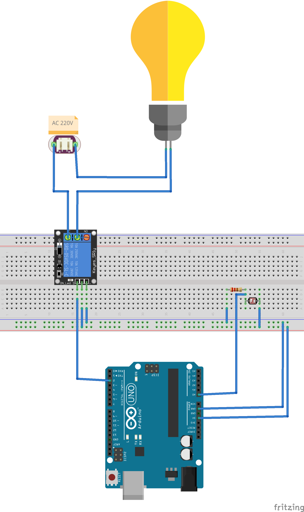

# NightLights

A simple project to switch on the lights when dark comes and switch them off when sun is shining.
It is implemented leveraging on TinyGo and an Arduino Uno board.

Hardware:
- Arduino Uno
- Photoresistor
- Relay

